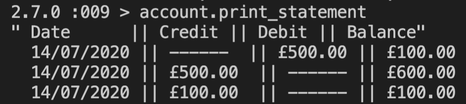

# Bank Tech Test - Ruby

<i>Please find source spec [here](https://github.com/makersacademy/course/blob/master/individual_challenges/bank_tech_test.md)</i>

Jump to:
* [Specification](https://github.com/sofyloafy/bank-tech-test#specification)
* [Quick Start](https://github.com/sofyloafy/bank-tech-test#quick-start)

### Challenge progress overview:
* User can create a new bank account
* User can deposit any sum
* User can withdraw any sum, funds-permitting
* User can view their statement in the below format:


* The statement is reverse-ordered


## Specification

### Requirements

* You should be able to interact with your code via a REPL like IRB or the JavaScript console.  (You don't need to implement a command line interface that takes input from STDIN.)
* Deposits, withdrawal.
* Account statement (date, amount, balance) printing.
* Data can be kept in memory (it doesn't need to be stored to a database or anything).

### Acceptance criteria

**Given** a client makes a deposit of 1000 on 10-01-2012  
**And** a deposit of 2000 on 13-01-2012  
**And** a withdrawal of 500 on 14-01-2012  
**When** she prints her bank statement  
**Then** she would see

```
date || credit || debit || balance
14/01/2012 || || 500.00 || 2500.00
13/01/2012 || 2000.00 || || 3000.00
10/01/2012 || 1000.00 || || 1000.00
```

## Quick Start

1. Clone this repo
2. Bundle install
3. Launch irb
4. Once in irb, type in:
```
require './lib/bank_account'

account = BankAccount.new(Transaction.new, Statement.new)
```
5. You can then withdraw, deposit, and see your statement!
```
account.deposit(1000)
account.withdraw(500)
account.print_statement
```
